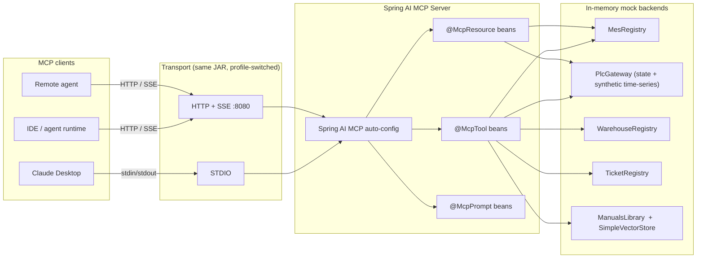

# spring-ai-mcp-server

A **Manufacturing Operations MCP server**, built on **Spring AI 1.1** and
**Spring Boot 3.4** (Java 21), that exposes a real-feeling shop-floor
toolbox over the **Model Context Protocol** — both via **STDIO**
(for Claude Desktop and other local MCP clients) and via **HTTP + Server‑Sent
Events** (for remote agents and IDE integrations) from the same jar.

> Companion of `spring-ai-rag-sample` (RAG primitive) and
> `spring-ai-agent-tool-use` (agent + tool calling). This repo closes the
> trio on the **other side** of the protocol: instead of *consuming* tools
> with a Spring AI ChatClient, it **publishes** tools, resources and prompts
> for any MCP-compatible client to discover and orchestrate.

---

## Why MCP, and how this differs from the agent showcase

| Aspect            | `spring-ai-agent-tool-use`                                    | `spring-ai-mcp-server` (this repo)                                  |
|-------------------|---------------------------------------------------------------|---------------------------------------------------------------------|
| Primitive         | AI Agent: multi-step tool-use loop                            | MCP Server: protocol-level capability publisher                     |
| Direction         | Application *consumes* tools internally                       | Application *exposes* tools to external clients                     |
| Client            | Internal `ChatClient` against OpenAI                          | Any MCP client: Claude Desktop, IDE plugin, agent runtime           |
| Surface           | REST `POST /chat`                                             | MCP over **STDIO** *and* **HTTP + SSE**                             |
| Capabilities      | Tools only                                                    | Tools, **Resources** *and* **Prompts** — full MCP protocol surface  |
| Domain            | Production Supervisor Assistant                               | Same domain; same names; portable to any client                     |

The narrative across the trio is intentional: the same manufacturing
domain (MES / PLC / WMS / CMMS, plus a maintenance-manuals corpus) is
re-shaped through three different AI primitives. This repo is the one
where the domain becomes **transport-portable**.

---

## What it exposes

### MCP Tools

| Tool                          | Declared by                  | Purpose                                                                                       |
|-------------------------------|------------------------------|-----------------------------------------------------------------------------------------------|
| `get_production_orders`       | `ProductionOrderTools`       | List MES production orders, optionally filtered by status                                     |
| `get_machine_telemetry`       | `MachineTelemetryTools`      | PLC time-series (temperature / vibration / current / cycles) over `LAST_5_MIN`/`LAST_HOUR`/`LAST_SHIFT` |
| `get_inventory_level`         | `InventoryTools`             | Stock-on-hand for a single material/spare-part code                                           |
| `create_maintenance_ticket`   | `MaintenanceTools`           | Open a CMMS ticket with priority `LOW`/`MEDIUM`/`HIGH`/`CRITICAL`                              |
| `search_manuals`              | `ManualsTools`               | Semantic search over a maintenance-manuals corpus *(RAG bridge to the companion repo)*        |

### MCP Resources

| URI                                     | Declared by                  | Purpose                                          |
|-----------------------------------------|------------------------------|--------------------------------------------------|
| `machines://list`                       | `MachineResources`           | Full shop-floor machine roster as JSON           |
| `production-order://{orderId}`          | `ProductionOrderResources`   | Single MES production order (e.g. `PO-2041`)     |

### MCP Prompts

| Prompt                            | Declared by             | Arguments                                                  |
|-----------------------------------|-------------------------|------------------------------------------------------------|
| `shift-handover-summary`          | `ShiftHandoverPrompt`   | `shift` (required), `supervisor` (required)                |
| `downtime-rca-investigation`      | `DowntimeRcaPrompt`     | `machine_id` (required), `observed_alarm` (optional)       |

---

## Architecture



### Package layout

```
io.pratico.springai.mcp
├── SpringAiMcpApplication           entry point
├── config/
│   └── ManualsRetrievalConfiguration   conditional VectorStore + ManualsTools (needs OPENAI_API_KEY)
├── server/
│   └── ToolInvocationLoggingAspect     AOP trace of every @McpTool call (args, result preview, latency)
├── tools/                           @McpTool — one class per bounded capability
│   ├── ProductionOrderTools
│   ├── MachineTelemetryTools
│   ├── InventoryTools
│   ├── MaintenanceTools
│   └── ManualsTools                  RAG bridge to the manuals corpus
├── resources/                       @McpResource handlers
│   ├── MachineResources              machines://list
│   └── ProductionOrderResources      production-order://{orderId}
├── prompts/                         @McpPrompt handlers
│   ├── ShiftHandoverPrompt           shift-handover-summary
│   └── DowntimeRcaPrompt             downtime-rca-investigation
├── domain/                          immutable records + enums (no leaking frameworks)
└── mockdata/                        in-memory simulators of MES / PLC / WMS / CMMS + manuals
```

---

## Quickstart

### Prerequisites

- JDK 21
- Maven 3.9+
- *(optional)* `OPENAI_API_KEY` **plus** `SPRING_AI_MODEL_EMBEDDING=openai` — only
  required to enable the `search_manuals` tool. By default both are unset, the
  embedding subsystem stays off, and the four non-RAG tools / two resources /
  two prompts run out of the box.

### Build

```bash
mvn clean install
```

### Run

**Default profile = `http`** — exposes MCP over HTTP + SSE on `:8080`:

```bash
mvn spring-boot:run
```

To enable the `search_manuals` RAG tool, run with both env vars set:

```bash
export OPENAI_API_KEY=sk-...
export SPRING_AI_MODEL_EMBEDDING=openai
mvn spring-boot:run
```

**STDIO profile** — for Claude Desktop and other local MCP clients:

```bash
mvn spring-boot:run -Dspring-boot.run.profiles=stdio
```

In STDIO mode the JVM's stdout *is* the protocol channel; the Spring banner and
the console log appender are silenced and logs are redirected to
`./logs/mcp-stdio.log`.

---

## Use with Claude Desktop

Build the runnable jar once with `mvn clean install`, then register the server
in your Claude Desktop config (`~/Library/Application Support/Claude/claude_desktop_config.json`
on macOS, `%APPDATA%\Claude\claude_desktop_config.json` on Windows):

```json
{
  "mcpServers": {
    "manufacturing-operations": {
      "command": "java",
      "args": [
        "-jar",
        "/absolute/path/to/spring-ai-mcp-server/target/spring-ai-mcp-server-0.1.0.jar",
        "--spring.profiles.active=stdio"
      ],
      "env": {
        "OPENAI_API_KEY": "sk-...",
        "SPRING_AI_MODEL_EMBEDDING": "openai"
      }
    }
  }
}
```

Restart Claude Desktop. The new server appears under **Tools & Resources** with
five callable tools, two browsable resources and two parametrized prompts.

---

## Use with an HTTP / SSE client

In HTTP profile the server speaks the MCP JSON-RPC envelope over Server-Sent
Events. The default endpoints are `GET /sse` (event stream) and `POST /mcp/message`
(client → server messages).

The MCP handshake is a three-message JSON-RPC exchange:

```bash
# 1. Open the SSE channel (keep this open in one terminal)
curl -N http://localhost:8080/sse

# 2. Send the initialize request on the message channel
curl -X POST http://localhost:8080/mcp/message \
  -H "Content-Type: application/json" \
  -d '{
        "jsonrpc": "2.0",
        "id": 1,
        "method": "initialize",
        "params": {
          "protocolVersion": "2024-11-05",
          "capabilities": {},
          "clientInfo": { "name": "curl", "version": "0.1" }
        }
      }'

# 3. List the tools the server published
curl -X POST http://localhost:8080/mcp/message \
  -H "Content-Type: application/json" \
  -d '{
        "jsonrpc": "2.0",
        "id": 2,
        "method": "tools/list"
      }'

# 4. Invoke a tool
curl -X POST http://localhost:8080/mcp/message \
  -H "Content-Type: application/json" \
  -d '{
        "jsonrpc": "2.0",
        "id": 3,
        "method": "tools/call",
        "params": {
          "name": "get_machine_telemetry",
          "arguments": { "machineId": "PRESS-03", "window": "LAST_HOUR" }
        }
      }'
```

The first response lands on the SSE stream from step 1; subsequent responses
are correlated by JSON-RPC `id`.

---

## Why these choices

- **Both transports in the same jar.** STDIO is necessary for Claude Desktop and
  any local MCP client; HTTP + SSE is necessary for cross-host integration with
  agent runtimes. Spring profiles make the switch a single CLI flag instead of
  two distinct artefacts.
- **One `@McpTool` class per bounded capability.** Each class wraps one mock
  backend (MES, PLC, WMS, CMMS, manuals) and never crosses backends. This
  mirrors the agent showcase repo and keeps the cognitive load of any single
  class low.
- **Domain records, not DTOs.** The objects returned by tools and resources are
  the same immutable records used internally — Spring AI's auto-serialization
  takes them straight to JSON. No anaemic DTOs, no mapping layer.
- **Conditional RAG subsystem.** `search_manuals` is the only capability that
  needs `OPENAI_API_KEY`. The whole RAG path is gated on the key being set, so
  removing the key degrades capability gracefully — the four non-RAG tools keep
  working.
- **Synthetic but believable telemetry.** `PlcGateway.getTelemetry(...)` produces
  deterministic, state-shaped samples (e.g. a `DOWN` machine looks anomalously
  hot with vibration spikes and zero current). That makes the `downtime-rca-investigation`
  prompt genuinely useful as a demo, not a flat mock.

---

## Roadmap

- Streamable-HTTP transport variant (`spring.ai.mcp.server.protocol=STREAMABLE`).
- Authenticated SSE endpoint with per-client API keys.
- Pluggable manuals backend (Postgres + pgvector) to converge on the
  `spring-ai-rag-sample` repo's setup.
- OpenTelemetry exporter on top of `ToolInvocationLoggingAspect`.

---

## License

MIT — see [LICENSE](LICENSE).
